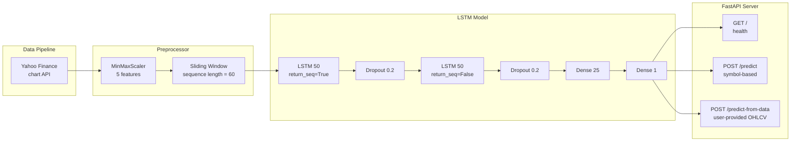

# Stock Pricing Predictor

LSTM-based deep learning model for stock price prediction with a FastAPI inference server. Predicts **NVDA (NVIDIA)** closing prices using multi-feature temporal sequences trained on 2020–2026 data.

## Architecture



- **Data pipeline** — Fetches OHLCV from Yahoo Finance chart API (`query2.finance.yahoo.com/v8/finance/chart`)
- **Preprocessing** — 5-feature `MinMaxScaler` (Close, Open, High, Low, Volume), 60-day sliding windows
- **Model** — Sequential LSTM: 2 stacked LSTM(50) layers with Dropout(0.2), Dense(25), Dense(1). Adam optimizer, MSE loss, EarlyStopping
- **Serving** — FastAPI with Pydantic validation, auto-generated Swagger docs at `/docs`

## Project Structure

```
stock-pricing-predictor/
├── src/
│   ├── data_collector.py      # Yahoo Finance REST client
│   ├── preprocessor.py        # Scaling, sequence creation, predict_future()
│   ├── lstm_model.py          # Keras LSTM architecture
│   ├── train.py               # Training orchestrator
│   └── evaluate.py            # Metrics (MAE, RMSE, MAPE) + plots
├── api/
│   └── app.py                 # FastAPI server
├── tests/
│   ├── test_data_collector.py # 7 tests — data integrity
│   ├── test_model.py          # 5 tests — LSTM architecture
│   └── test_preprocessor.py   # 11 tests — scaling, sequences, predict_future
├── docs/
│   └── swagger.yaml           # OpenAPI 3.1 specification
├── models/                    # Saved .keras model + .pkl scaler
├── outputs/                   # CSV data + prediction plots
├── notebooks/
│   └── eda.ipynb              # Exploratory data analysis
└── requirements.txt
```

## Model Performance

| Metric | Value |
|--------|-------|
| Training period | 2020-01-01 → 2026-07-24 |
| Data points | 1,647 trading days |
| Sequence length | 60 days |
| Best epoch | 66 (EarlyStopping) |
| **MAE** | **$7.60** |
| **RMSE** | **$9.50** |
| **MAPE** | **3.88%** |
| Train/Val/Test split | 70% / 15% / 15% (chronological) |

## Quick Start

```bash
# 1. Clone and set up environment
python3 -m venv .venv
source .venv/bin/activate
pip install -r requirements.txt

# 2. Train the model
PYTHONPATH=. python src/train.py

# 3. Evaluate
PYTHONPATH=. python src/evaluate.py

# 4. Run the API
uvicorn api.app:app --reload
```

## API Endpoints

### `GET /`

Health check.

```bash
curl http://localhost:8000/
# {"status":"ok","model":"LSTM","symbol":"NVDA"}
```

### `POST /predict`

Predicts future close prices for a given stock symbol. Internally fetches 1 year of historical data from Yahoo Finance.

```bash
curl -X POST http://localhost:8000/predict \
  -H "Content-Type: application/json" \
  -d '{"symbol":"NVDA","days":7}'
```

Response:

```json
{
  "symbol": "NVDA",
  "predicted_close": [196.19, 195.15, 193.93, 192.76, 191.81],
  "currency": "USD"
}
```

### `POST /predict-from-data`

Predicts future close prices from **user-provided** historical OHLCV data. Must contain at least 60 rows (sequence length).

```bash
curl -X POST http://localhost:8000/predict-from-data \
  -H "Content-Type: application/json" \
  -d '{
    "historical_data": [
      {"date":"2026-07-01","open":195.0,"high":198.0,"low":193.0,"close":197.5,"volume":120000000},
      ...
    ],
    "days": 5
  }'
```

Response:

```json
{
  "predicted_close": [196.19, 195.15, 193.93, 192.76, 191.81],
  "currency": "USD"
}
```

> Open `http://localhost:8000/docs` for the interactive Swagger UI.

## OpenAPI Specification

The full API spec is at [`docs/swagger.yaml`](docs/swagger.yaml) — OpenAPI 3.1.0, 3 paths, 8 schemas with validation rules, examples, and error responses.

```bash
# Preview with Swagger UI in Docker
docker run -p 8080:8080 -v $(pwd)/docs/swagger.yaml:/spec.yaml:ro \
  -e SWAGGER_JSON=/spec.yaml swaggerapi/swagger-ui
```

## Running Tests

```bash
source .venv/bin/activate
PYTHONPATH=. python -m pytest tests/ -v
```

## EDA Notebook

```bash
jupyter notebook notebooks/eda.ipynb
```

Covers: closing price trends, 20/50-day moving averages, daily returns distribution, trading volume, and feature correlation heatmap.

## Tech Stack

| Layer | Technology |
|-------|-----------|
| Data | `pandas`, `numpy`, Yahoo Finance REST API |
| Preprocessing | `scikit-learn` (MinMaxScaler) |
| Deep Learning | `tensorflow` / `keras` (LSTM) |
| API | `FastAPI` + `Pydantic` |
| Serialization | `.keras` (model), `joblib` (scaler) |
| Visualization | `matplotlib` |
| Testing | `pytest` |


## Monitoring & Scalability

The API includes real-time telemetry, response time tracking, and resource monitoring using Prometheus and Grafana.

### Architecture
1. **FastAPI Instrumentator**: Exposes HTTP request latency, status codes, and traffic volume via `/metrics`.
2. **Prometheus**: Scrapes `/metrics` every 5 seconds.
3. **Grafana**: Visualizes real-time performance, latencies, and active throughput.

### Running with Docker Compose

```bash
docker-compose up -d
```

### Monitoring Endpoints

| Service | URL | Description |
|---|---|---|
| **API** | `http://localhost:8000` | Health check and prediction endpoints |
| **Prometheus** | `http://localhost:9090` | Metrics scraper — raw PromQL interface |
| **Grafana** | `http://localhost:3000/d/stock-model-performance/stock-predictor-performance-do-modelo?orgId=1&refresh=10s&from=now-15m&to=now` | Pre-built dashboard with latency, throughput, resource usage |

> **Grafana login:** `admin` / `admin`

### Dashboard Panels

- **Visão Geral** — total predictions, P50 latency, error rate, model load time
- **Latência** — HTTP p50/p95/p99 and HTTP vs model inference comparison
- **Throughput** — requests per second and predictions per minute by endpoint
- **Recursos e Erros** — CPU, memory, HTTP status breakdown, latency alerts